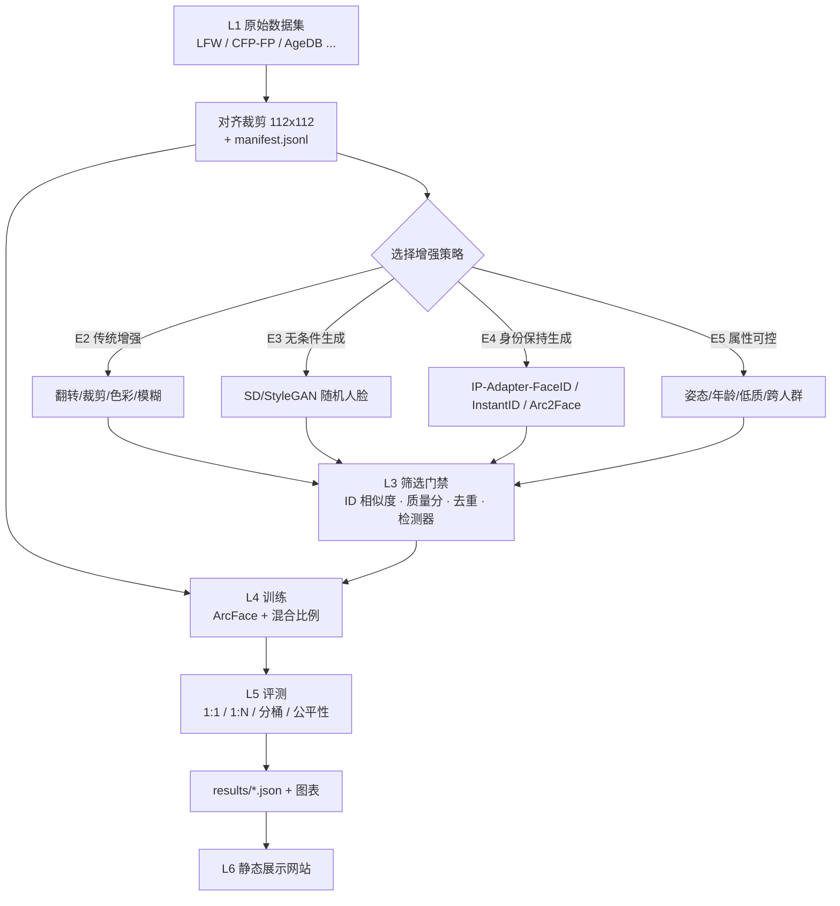

# 项目框架（Framework）

> **一句话**：用生成式 AI 造人脸，看看能不能让人脸识别（Face Recognition, FR）模型变得更强——并且把「**能不能、为什么、代价是什么**」用可复现的实验讲清楚，最后做成一个展示网站。

本文档回答三个问题：**做什么**、**为什么这么做**、**系统长什么样**。
配套文档：[`WORKFLOW.md`](WORKFLOW.md) 回答「按什么顺序做、每一步怎么验收」；[`issues/`](issues/) 是拆好的任务卡。

---

## 0. 给零基础的你：先读这一节

这个项目有两条并行的线，不要混：

| 线 | 内容 | 什么时候做 |
|---|---|---|
| **学习线** | 六个阶段 L0~L6：从「两张脸怎么比」到「扩散模型条件注入」到「实验方法与统计」——**完整路线、材料、动手练习、自测题见 [`LEARNING.md`](LEARNING.md)** | 边做边学，每阶段开始前集中 2~3 小时 |
| **工程线** | 把「数据 → 生成 → 筛选 → 训练 → 评测 → 网站」这条流水线搭起来 | 按 Milestone 推进 |
| **协作线** | 两人两机：档位分工、分支与评审、数据与产物同步 | 见 §11 与 [`WORKFLOW.md`](WORKFLOW.md) §7 |

**最重要的心态**：
1. 你不需要发明新算法。这个项目的价值在于**把别人的方法串起来、把数字诚实地测出来、把结论清楚地讲出来**。
2. **没有对照组的实验等于没有实验**。任何「加了合成数据变好了」的结论，都必须有「只用真实数据」的基线。
3. **先跑通一条丑陋但完整的闭环**（约 100 张图走完全流程），再去加厚每一层。永远不要先花两周把某一层做到完美。

---

## 1. 项目定位

### 1.1 目标

系统性地回答一个具体问题：

> 在**消费级硬件**（两台配置不同的开发机：从小显存笔记本 GPU 到无独显的机器都可能）和**小规模数据**的现实约束下，用 AIGC 生成的人脸图像来扩充人脸识别训练集，**能带来多少收益？收益从哪里来？代价是什么？**

### 1.2 三层交付物

| 层 | 交付物 | 验收方式 |
|---|---|---|
| **学习层** | `docs/BACKGROUND.md`：术语地图 + 15 篇核心论文摘要 + 3 张对照表 | 你能对着白板讲清楚「身份保持生成」和「域差距」 |
| **实验层** | `results/`：6 组对照实验的数字（含多 seed）+ `docs/RESULTS.md` 结论 | 每个数字都能用一条命令复现 |
| **展示层** | `site/`：静态展示网站（方法图、图库、指标看板、公平性、复现指南） | 打开网页能看懂整个项目，不需要读代码 |

### 1.3 明确不做的事（Non-goals）

范围控制比努力更重要。以下内容**明确不做**，如果有人（包括你自己）提议，先回到这一节：

- ❌ 不追求 SOTA 精度，不下载/训练 MS1M、WebFace260M 这类工业级数据集（消费级显存跑不动，也没有必要）。
- ❌ **不做换脸、不做真人身份克隆**。不使用名人或他人照片去驱动生成模型「伪造某个具体的人」。生成只使用生成模型自身的身份先验（随机身份）或公开研究数据集中的身份，用于**研究用途**。
- ❌ 不做线上服务、不做实时系统、不做产品化的人脸识别 SDK。
- ❌ 不做 3D 人脸重建、不做视频生成、不做语音/多模态。
- ❌ 不把任何原始人脸数据集提交到 Git 仓库（见 §8 合规）。

---

## 2. 研究问题（RQ）与假设

每个 RQ 都必须对应**一个实验**、**一张图**、**至少一个 Issue**。对不上的 RQ 就是空话。

| ID | 研究问题 | 初始假设 | 对应实验 | 网站上的呈现 | 相关 Issue |
|---|---|---|---|---|---|
| **RQ1** | 加入合成数据，识别性能会变好吗？ | 少量（10%~25%）合成数据可能有小提升；纯合成会明显下降 | E0–E5 | 指标看板 + 柱状图 | #14, #15 |
| **RQ2** | 身份保持生成（同一身份、不同姿态光照）比无条件生成强多少？ | 身份保持生成明显更强，无条件生成接近「噪声/正则化」效果 | E3 vs E4 | 对比柱状图 + 图库 | #9, #10, #14 |
| **RQ3** | 收益来自「图片数量」还是「多样性」？ | 主要来自多样性；单纯重复采样真实图收益接近于 0 | E2 vs E4（控制图片总数） | 消融表 | #8, #14 |
| **RQ4** | 代价是什么？（域差距 / 公平性 / 可检测性） | 合成图会带来域偏移，且生成器自身存在人群偏向 | 分桶评测 + 公平性 + 检测器 | 公平性页 + 失败案例页 | #7, #12, #13 |
| **RQ5** | 消费级硬件上的**最低可行配方**是什么？不同硬件档位分别能跑到哪一步？ | 存在一个「够用」的配置：512×512、SD1.5 级别模型、数百张合成图；B 档机器也能完成全部核心实验 | 全流程记录 + 档位矩阵 | 复现指南页 | #1, #9, #10, #20, #16 |

> 💡 **写论文/报告的纪律**：RQ4 和 RQ5 是这个项目区别于「调包跑个 demo」的地方。哪怕 RQ1 的结果是「提升不明显」，只要测出来了、解释清楚了，就是合格的项目结论。

---

## 3. 系统架构

### 3.1 分层架构

设计的核心思想：**每层只依赖上一层的产物文件，不依赖上一层的代码**。这样任何一层都可以被替换、单独调试、并行开发。

```
┌──────────────────────────────────────────────────────────────────────┐
│ L6 展示层   Static Site (Vite + React + ECharts)  ← results/*.json   │
├──────────────────────────────────────────────────────────────────────┤
│ L5 评测层   evaluator: 1:1 验证 / 1:N 识别 / 分桶鲁棒性 / 公平性      │
├──────────────────────────────────────────────────────────────────────┤
│ L4 训练层   ArcFace 训练（real-only / real+aug / real+synth / 混合比）│
├──────────────────────────────────────────────────────────────────────┤
│ L3 筛选层   identity 一致性 + 质量分 + 去重 + 合成检测 → 准入/拒绝     │
├──────────────────────────────────────────────────────────────────────┤
│ L2 生成层   传统增强 | 无条件生成 | 身份保持生成 | 属性可控生成       │
├──────────────────────────────────────────────────────────────────────┤
│ L1 数据层   下载 → 对齐裁剪(112×112) → manifest.jsonl（统一契约）      │
├──────────────────────────────────────────────────────────────────────┤
│ L0 环境层   Python 环境 / PyTorch(CUDA) / ONNX Runtime / 配置系统      │
└──────────────────────────────────────────────────────────────────────┘
        ▲ 横向支撑：配置管理 · 实验追踪 · 测试 · 合规与伦理 · 文档
```

同一张图的 Mermaid 版本（GitHub 上可直接渲染）：



### 3.2 一条样本的生命周期（把架构讲成人话）

1. **出生**：从公开评测集里拿到一张真实人脸照片（例如 LFW 里的某个人）。
2. **对齐**：用 5 点关键点做相似变换，裁剪成 112×112 的标准 ArcFace 模板尺寸。**这一步做错，后面所有指标都不可信**。
3. **登记**：写进 `manifest.jsonl`，分配 `image_id`、`identity_id`、`source=real`。
4. **增殖**：生成层读取这张图（或它的身份），产出 0~K 张新图，登记时 `source=synth`，并记录 `parent_image_id` 和 `generator`。
5. **体检**：筛选层给每张生成图打分——和该身份真实图中心的余弦相似度够不够？质量分够不够？是不是和已有图重复？通过 `>= 阈值` 才准入，否则 `rejected`（也要记录，用于分析）。
6. **上学**：训练层按配置的比例，把 real + 准入的 synth 混在一起，训练一个 ArcFace 分类模型。
7. **考试**：评测层用**完全独立的评测集**（训练时绝不可见）测 1:1 验证、1:N 识别、不同姿态/质量分桶、不同人群分组。
8. **留档**：所有数字写进 `results/runs/<exp_id>/metrics.json`，并由导出脚本转成网站用的 `site/public/data/*.json`。

### 3.3 层间契约（整个框架最重要的部分）

**只要契约不变，实现随便换。** 这是让一个零基础的人也能把项目做完的关键。

#### 契约 A：`manifest.jsonl`（数据清单，每行一个 JSON）

| 字段 | 类型 | 说明 |
|---|---|---|
| `image_id` | string | 全局唯一，例如 `lfw_0001_03` / `syn_lfw_0001_03_g02` |
| `path` | string | 相对仓库根的路径，例如 `data/processed/aligned/xxx.png` |
| `identity_id` | string | 身份 ID，同一人的所有图共享 |
| `source` | enum | `real` / `aug` / `synth` |
| `generator` | string\|null | 生成器标识，如 `ipadapter-faceid-sd15`；`real` 为 `null` |
| `parent_image_id` | string\|null | 由哪张图生成而来（追溯用） |
| `split` | enum | `train` / `val` / `test` |
| `status` | enum | `accepted` / `rejected` / `pending`（筛选结果） |
| `meta` | object | 自由字段：`id_sim`、`quality`、`pose_yaw`、`reject_reason` 等 |

#### 契约 B：`results/runs/<exp_id>/metrics.json`（实验结果）

```jsonc
{
  "exp_id": "e4-ipadapter-r25-seed0",
  "created_at": "2026-10-01T12:00:00+08:00",
  "config_path": "configs/exp/e4-ipadapter-r25.yaml",
  "config_hash": "ab12cd34",
  "train_set": {
    "real_identities": 100, "real_images": 1800,
    "synth_images": 600, "synth_ratio": 0.25,
    "generator": "ipadapter-faceid-sd15", "filter_threshold": 0.45
  },
  "model": { "arch": "iresnet50", "loss": "arcface", "epochs": 30, "seed": 0 },
  "benchmarks": {
    "lfw":      { "metric": "accuracy", "value": 0.9870, "n_pairs": 6000 },
    "cfp_fp":   { "metric": "accuracy", "value": 0.9501, "n_pairs": 7000 },
    "agedb_30": { "metric": "accuracy", "value": 0.9412, "n_pairs": 6000 }
  },
  "fairness": { "rfw_caucasian": 0.98, "rfw_asian": 0.97, "rfw_indian": 0.97, "rfw_african": 0.96 },
  "buckets":  { "pose_frontal": 0.98, "pose_profile": 0.93, "low_quality": 0.95 },
  "artifacts": { "ckpt": "results/runs/.../best.pth", "curves": "results/runs/.../curves.png" },
  "notes": "合成图筛选阈值 0.45，人工抽检 50 张"
}
```

> 这个 schema 是**网站数据导出的唯一依据**。先把 schema 定死，网站和实验就能并行开发。

#### 契约 C：目录与配置约定

- 一个实验 = 一个 YAML 配置（`configs/exp/*.yaml`）+ 一个输出目录（`results/runs/<exp_id>/`）。
- `exp_id` 命名规范：`{阶段}-{生成器}-{比例}-{seed}`，例：`e4-ipadapter-r25-seed0`。
- 配置里必须显式写 `seed`、`data.manifest`、`train.real_only|mix_ratio`、`eval.benchmarks`。
- 配置分三层（**科学设定 / 档位资源设定 / 机器私有设定**），详见 §4.3 与 #20；`metrics.json` 里必须记录实际生效的档位与 batch。

### 3.4 为什么这样分层（设计依据）

| 设计 | 解决的问题 |
|---|---|
| 层间只用文件契约 | 生成模型换代（SD1.5 → SDXL → 新模型）时，训练/评测代码一行不用改 |
| manifest 单一数据源 | 避免「这份实验用了哪些图」说不清楚；天然支持复现和溯源 |
| 筛选层独立且记录 rejected | 方便回答「收益是不是被低质量图拖累了」这类问题 |
| 实验配置与结果一对一 | 支持自动跑批（issue #14 的矩阵实验就是循环读配置） |
| 网站只读 `metrics.json` | 网站开发可以和实验并行，互不阻塞 |

---

## 4. 技术选型

> ⚠️ 以下版本信息在 #1 里会被**实际验证并公示**（结果贴到 Issue #1 评论；环境自检工具是一次性脚手架，**不进仓库**）。不要盲信文档，以**你自己那台机器**上的实测为准。
>
> 🔧 **本项目由两人在两台不同配置的机器上开发**，所以本节的原则是：**"科学设定"统一，"资源设定"随机器；能用同一套代码，不要写死任何机器相关的参数。**

| 模块 | 首选 | 跨机器 / 跨平台注意 | 备选 |
|---|---|---|---|
| Python 环境 | Conda / Miniconda + **Python 3.11 或 3.12** | **两人必须用同一个 Python 次版本**（3.11 或 3.12 二选一），否则依赖解析结果会不同。不建议 3.13+（wheel 覆盖不全） | uv / venv（若两人都同意） |
| 深度学习框架 | **PyTorch**，轮子版本**按各自机器的 CUDA 选** | 不是所有人都要 cu128：老卡选 cu121/cu126，新卡（RTX 50 系 = sm_120）必须 **cu128 且 PyTorch ≥ 2.7**；没有独显就用 CPU 轮子 | 统一走 CPU（仅作降级，速度差几十倍） |
| ONNX Runtime | **`onnxruntime-gpu==1.26.0`**（Windows/Linux + NVIDIA） | ⚠️ **必须钉死版本**：PyPI 上的 GPU 包**从 1.27 起默认改为 CUDA 13 构建**，与 cu128 的 torch（CUDA 12.8）不匹配 → CUDA EP 加载失败并**静默退回 CPU**；官方兼容表里 **1.21.x~1.26.x = CUDA 12.8 + cuDNN 9**，正好对上。⚠️ 代码里**创建 InferenceSession 前必须先 `import torch`**（torch 会注册自带的 CUDA DLL 目录），否则同样退回 CPU | macOS 用 CoreML EP、无独显用 `onnxruntime`（CPU）；GPU 版与 CPU 版**不要同时装** |
| 识别基线（不训练） | **insightface + ONNX Runtime**（`buffalo_l`/`antelopev2`） | 模型包仅限**非商业研究**；`FaceAnalysis` 的 provider 顺序因平台而异，**必须打印 providers 确认** | `facenet-pytorch` |
| 识别模型（训练） | 自己实现的 **ResNet(iresnet) + ArcFace**（PyTorch） | 显存不同 → **batch 由 profile 决定**（见 §4.3），不是写死在代码里 | insightface `arcface_torch`（较重） |
| 生成（A 轨·主力） | **Arc2Face**（SD1.5 + 纯 ArcFace embedding 条件）或 **IP-Adapter-FaceID（SD1.5）** | 512×512、显存友好；**显存 < 8 GB 时降到 384×384 或改用 B 轨** | IDiff-Face（128²，CC BY-NC-SA）、DCFace（112~128²） |
| 生成（B 轨·保底） | 直接下载**已公开的合成人脸数据集**：DigiFace-1M（122 万张 / 11 万身份）、DCFace、CemiFace、Digi2Real | **完全不占显存、不挑机器**——这正是两人机器不一致时最该先做的一条 | 无条件 SD 生成 |
| 图像质量/分布指标 | `clean-fid`(FID) / `torchmetrics`(KID) / `pyiqa`(NIQE, BRISQUE) | pyiqa 为 **PolyForm Noncommercial**（非商业） | 自己实现 Laplacian 方差 |
| 实验管理 | **文件即记录**（配置 + JSON + CSV） | 跨机器协作时，**文件比服务可靠**（不要依赖某个人的本地 MLflow） | MLflow（可选） |
| 网站 | **Vite + React + TypeScript + ECharts**，纯静态 | 谁都能 build；Node 版本写进 `.nvmrc`/`engines` | 手写 HTML + ECharts CDN |
| 测试 | `pytest` | 契约测试**必须跨机器通过**，这是两人协作的安全网 | — |

> **生成层采用「双轨制」，这是本框架的重要决策**：B 轨（下载现成合成数据）几乎零成本、不挑机器，先跑通「合成数据 → 训练 → 评测」的因果链；A 轨（本地身份条件生成）才是本项目的 AIGC 主线。**先 B 后 A**，可以保证即使 A 轨在某台机器上受限，项目依然有完整结论。
>
> ⚠️ **不可行/需降级的选项（已核实）**：PhotoMaker 官方要求 ≥11 GB 显存；PuLID-FLUX 需 11~16 GB；InstantID 与 IP-Adapter-FaceID-SDXL 走 SDXL 路线，必须开 `enable_model_cpu_offload()` + VAE 分块，速度较慢——都不作为首选。
>
> ⚠️ **许可陷阱（写进 #18）**：Arc2Face / InstantID / IP-Adapter-FaceID / PuLID 都依赖 insightface 的人脸模型（`antelopev2`/`buffalo_l`），而这些**模型包仅限非商业研究用途**；InstantID 与 IP-Adapter-FaceID 的权重本身也是 research-only。**「代码是 MIT」不等于「整条链路可商用」。**

### 4.1 硬件分层：三档配置档案（A / B / C）

既然两台机器不一样，就**不要按机器写代码，而是按"能力档位"配置**。每台机器在 Issue #1 评论里公示自己的档位判定（#1 的产出；工具与报告不进仓库），之后所有参数都由档位推导（#20）。

| 档位 | 典型机器 | 能跑什么 | 生成默认 | 训练默认 | 不能做什么 |
|---|---|---|---|---|---|
| **A 档**<br/>大显存独显 | ≥ 12 GB 显存（如 RTX 3060 12G / 4060Ti 16G / 4070+） | 全部，含 SDXL 路线 | 512×512（可用 SDXL），batch 2~4 | 112×112，batch 128~256，AMP | — |
| **B 档**<br/>小显存独显 | 6~8 GB 显存（如 RTX 5060 Laptop 8G / 3050 6G） | A 轨（SD1.5 路线）+ 全部训练 | 512×512，batch 1~2，fp16，必要时 CPU offload | 112×112，batch 64~128，AMP + 梯度累积 | SDXL 路线（InstantID / PhotoMaker / PuLID）、大分辨率生成 |
| **C 档**<br/>无独显 / macOS / 集显 | CPU 或 Apple Silicon | **B 轨全部**、数据管线、评测（小规模）、网站、文档 | 不建议本地生成（或极小规模试跑） | 极小规模训练或直接用预训练模型 | A 轨生成、任何正规训练 |

**档位使用规则**：
1. **A/B 档都能跑完整实验**；C 档的成员负责**数据层、评测层、网站、文档与实验分析**，不承担重训练（见 #19 的分工）。
2. 一切"能不能跑"的判断**问档位，不问机器型号**——这样换机器、加机器都不用改代码。
3. 从 C 档升到 A 档、或 A 换 B，只需要换 profile 文件，**不改任何一行代码**。

### 4.2 环境泛化规则（两人两机必须遵守）

| 规则 | 原因 |
|---|---|
| **Python 次版本两人统一**（都 3.11 或都 3.12） | 不同次版本会导致依赖解析与部分库行为不一致 |
| **依赖分两层写**：`environment.yml`（通用、入库）+ `environment.local.yml`（机器私有、**不入库**） | 通用层保证一致，私有层容纳 CUDA 变体、平台差异 |
| 代码里**禁止出现绝对路径**，统一走配置与 `pathlib` | 两人盘符/目录结构必然不同 |
| 路径、缓存目录、显存上限等**只写在 `configs/local.<machine>.yaml`** 且**不入库** | 机器私有设定不该污染仓库 |
| 注意力实现统一用 **PyTorch 自带的 SDPA** | Windows 无 FlashAttention；xformers 对 Blackwell 的支持很晚才到，别按旧教程装 |
| 数据与权重**不入库**，靠下载脚本 + 校验和复现 | 两台机器各自下载，避免几十 GB 的传输 |
| 每台机器跑完都把**档位与版本信息贴到 Issue #1** | 出问题时能快速判断"是谁的环境" |

### 4.3 配置分层（把"泛化"落到工程上）

配置分三层，**越往下越私有、越不影响科学结论**：

```
configs/
├─ base.yaml                  # ① 科学设定：数据来源、模型、loss、epoch、评测集、seed —— 两人必须一致
├─ profiles/
│  ├─ a.yaml                  # ② 资源设定：batch / 分辨率 / AMP / num_workers / offload
│  ├─ b.yaml                  #    按档位选，可以不同，但必须被记录进 metrics.json
│  └─ cpu.yaml
└─ local.<machine>.yaml       # ③ 机器私有：【不入库】路径、缓存、显存上限、线程数
```

**三条硬规则**：
1. **①科学设定不许因机器而变**——变了就不是同一个实验。
2. **②资源设定可以变，但必须记录**：`metrics.json` 里要写 `hardware_profile`、`batch_size`、`amp`、`torch_version`、`gpu_name`（契约 B 已含）。
3. **③机器私有设定绝不允许影响结果**：只放路径与性能参数，不许放超参。

> ⚠️ **跨机器可比性（关键）**：`batch size` 会**真实影响**训练结果（尤其小数据集 + 归一化层）。因此：
> **同一组对比实验（如同一张消融矩阵）必须尽量在同一台机器上、用同一个 profile 跑完。**
> 若确实要跨机器，则必须**固定 batch 与精度**，并在报告里标注两台机器的差异。
> 详见 [`WORKFLOW.md`](WORKFLOW.md) §3.4。

### 4.4 数据与算力的务实取舍

- **用 LFW 构建 toy 闭集训练集**：LFW 有 1680 个身份，其中一部分身份有 15 张以上图片，足以做小规模闭集分类训练，且可公开下载。
- **评测集只用公开可下载的**：LFW / CFP-FP / AgeDB-30 / CALFW / CPLFW / RFW（各 issue 里会给出下载方式与许可注意）。
- **不追求和大论文比绝对精度**：我们的数字会比论文低很多（数据量差 3 个数量级），这**不是问题**——我们比的是**自己内部的相对差异**，且必须多 seed 重复。

---

## 5. 实验设计

### 5.1 实验矩阵（E0–E5）

| ID | 实验 | 训练数据 | 回答的问题 | 对应 Issue |
|---|---|---|---|---|
| **E0** | Zero-shot 基线 | 不训练，直接用预训练模型 | 评测管线本身对不对？天花板在哪？ | #5 |
| **E1** | Real-only | 只用真实图 | **一切对比的基准线** | #6, #7 |
| **E2** | Real + 传统增强 | 真实图 + 翻转/裁剪/色彩/模糊/降质 | 收益是否只来自「图片变多」？ | #8 |
| **E3** | Real + 无条件合成 | 真实图 + 生成模型随机人脸 | 无身份约束的合成数据有用吗？ | #9 |
| **E4** | Real + 身份保持合成 ★核心 | 真实图 + 同身份不同姿态/光照 | AIGC 的核心价值假设 | #10, #11 |
| **E5** | 混合比例消融 | 合成占比 0 / 10 / 25 / 50 / 100% | 最优比例在哪？越多越好吗？ | #14 |
| **E6** | 属性可控/跨域（加分） | 定向生成困难样本（侧脸、低质、跨人群） | 能不能针对性补短板？ | #13 |

**公平比较的纪律（写在每个实验配置里，违反即实验作废）**：
1. 同一组评测集、同一套评测代码、同一超参（除数据组成外，训练超参**不许**为了让某个实验好看而调）。
2. 训练总步数/epoch 数的处理必须一致：要么固定 epoch（合成图越多看到的总图数越多），要么固定总迭代次数（合成图被重复采样）——**在配置里写明选哪种**。
3. 每个配置至少 **3 个随机种子**，报告 **均值 ± 标准差**，不报单次最好结果。
4. 训练身份与评测身份**严禁重叠**（泄漏会让所有数字虚高）。

### 5.2 评测协议

| 协议 | 用什么 | 指标 |
|---|---|---|
| 1:1 人脸验证 | LFW(6000 对)、CFP-FP、AgeDB-30、CALFW、CPLFW | Accuracy；有条件时 TAR@FAR=1e-3 |
| 1:N 识别（闭集） | toy 测试身份集（与训练身份不重叠） | Rank-1 / Rank-5 |
| 鲁棒性分桶 | 按姿态角、图像质量分、是否戴口罩/遮挡分桶 | 每桶 Accuracy，看**桶间差距** |
| 公平性 | RFW 的 4 个人群分组（Caucasian / Asian / Indian / African） | 每组 Accuracy 与**最大组间差** |
| 分布与可检测性 | 真实 vs 生成图 | FID / KID；合成检测器的 AUC |

> ⚠️ **数据可得性（已核实，直接影响计划）**：
> - **IJB-C 已无法获取**——NIST 于 2023-03-14 停止 IJB-A/B/C 的分发。**不要把它写进计划。**
> - **AgeDB-30 / RFW 需要邮件申请**（AgeDB 的压缩包有密码，RFW 明确要求申请），当作加分项而非必经路径。
> - **LFW 官方站点不稳定**，torchvision 也已不再自动下载——准备 Kaggle 等镜像并预留时间。
> - **LFW / CALFW / CPLFW 复用同一批身份**，不是三个独立测试。
> - **LFW 系列早已饱和**（好模型 99.8%+），只看它会掩盖问题。建议至少加一个不易饱和的指标：**TinyFace（1:N Rank-1，约 148 MB，可直接下载）** 或你自己的 1:N 闭集测试。
> - 详见 [`REFERENCES.md`](REFERENCES.md) 第 3 节。

> ⚠️ **比较口径必须写清楚（issue #14 的硬要求）**：两种"加合成数据"的公平比较方式回答的是**不同问题**——
> **等总图片数**（real+synth 总数 = 纯 real 的总数）问的是「合成数据能否**替代**真实数据」；
> **等真实图片数**（在 real 之上**追加** synth）问的是「追加合成数据能否带来**增益**」。
> 两者的结论可能相反，**最好都报**，并在配置和文档里标明用的是哪种。

> 💡 公平性和分桶评测是「加分项」，但它们才是让项目有观点的部分。哪怕只做 RFW 一组（或改用可下载的 TinyFace 1:N），也值得做。

### 5.3 可视化产物（网站要用）

| 图 | 内容 | 消费者 |
|---|---|---|
| Pipeline 图 | 3.1 的流程图重绘成网站风格 | 方法页 |
| 图库对比 | 同一身份：真实图 vs 生成图（网格） | 图库页 |
| 身份内多样性 | 同一身份生成图的 embedding 分布/相似度分布 | 图库页 |
| 指标柱状图 | E1–E4 × 各评测集 Accuracy，带误差棒 | 指标页 |
| 比例曲线 | 合成比例 vs Accuracy | 指标页 |
| 公平性雷达/分组条形图 | 4 组人群 × 各实验 | 公平性页 |
| 失败案例墙 | 生成失败 / 识别失败样本，带原因标注 | 失败案例页 |
| 筛选漏斗图 | 生成 N 张 → 通过筛选 M 张 → 各拒绝原因占比 | 方法页 |

---

## 6. 仓库结构

```
AIGC-in-Face-Recognition-Dataset-Augmentation/
├─ configs/           # YAML 配置（三层，见 §4.3）
│  ├─ base.yaml       #   ① 科学设定：两人必须一致
│  ├─ profiles/       #   ② 档位资源设定：a.yaml / b.yaml / cpu.yaml
│  ├─ local.*.yaml    #   ③ 机器私有：【不进 Git】路径、缓存、显存上限
│  ├─ data/ gen/ train/ filter/ eval/   # 各层参数
│  └─ exp/            #   实验配置 + matrix.yaml
├─ data/              # 【不进 Git】raw → interim → processed + manifests
├─ docs/              # 文档：FRAMEWORK / WORKFLOW / LEARNING / REFERENCES / BACKGROUND / RESULTS / ETHICS / issues
├─ notebooks/         # 探索性分析（不参与复现链路）
├─ results/           # 【进 Git】runs/<exp_id>/metrics.json + 图表 + summary.csv
├─ reports/           # 【进 Git】分析报告与图表（环境自检类结果贴 Issue，不落仓库）
├─ scripts/           # 一键入口：setup / download / generate / filter / train / eval / export
├─ src/aigcfr/        # 核心包
│  ├─ data/           # 下载、对齐、manifest 读写与校验
│  ├─ generate/       # 各生成器适配器（统一接口）
│  ├─ filter/         # 身份一致性、质量、去重、检测器
│  ├─ train/          # 数据集加载 + ArcFace 训练
│  ├─ eval/           # 评测器（1:1 / 1:N / 分桶 / 公平性）
│  └─ report/         # 汇总与网站数据导出
├─ site/              # Vite + React 静态展示站
├─ tests/             # pytest：契约校验 + 指标正确性
├─ tools/             # 项目运维脚本（建 issue 等）
└─ .github/           # Actions（CI、Pages 部署）+ issue 模板
```

**每个生成器都实现同一个接口**（这是可替换性的具体体现）：

```python
class FaceGenerator:              # 伪代码，见 issue #9 / #10
    name: str
    def generate(self, identity_refs: list[Path], n: int, cfg) -> list[GeneratedImage]: ...
```

---

## 7. 风险与对策

| # | 风险 | 概率 | 影响 | 对策 |
|---|---|---|---|---|
| R1 | 环境装不上（Python/驱动/torch 版本不匹配、新架构不支持） | 高 | 卡住 1~2 天 | #1 单独做「环境自检 + 档位判定」并落报告；按机器的 CUDA 版本选轮子 |
| R2 | 显存不足（OOM） | 高 | 生成/训练失败 | 由**档位**决定 batch/分辨率（#20）；fp16、CPU offload、错峰运行 |
| R10 | **两人机器不一致导致结果不可比** | 中 | 结论不可信 | 科学设定统一；同一组对比实验在同一台机器同一 profile 上跑完；`metrics.json` 记录档位与 batch |
| R3 | 生成质量差/身份漂移 | 高 | 实验无意义 | 筛选门禁（#11）+ 人工抽检；先小批量验证再放量 |
| R4 | 数据集下载链接失效或需申请 | 中 | 进度受阻 | 每个数据集准备 2 个来源；实在不行只保留 LFW + CFP-FP |
| R5 | 数据/license 违规（把原始人脸数据提交到仓库） | 中 | 严重（隐私/法律） | `.gitignore` 硬隔离 `data/`；`docs/ETHICS.md`（#18）；只发布生成图与指标 |
| R6 | 结论过度声称（overclaim） | 中 | 学术诚信问题 | `docs/RESULTS.md` 强制写「局限」小节；多 seed；不报单次最优 |
| R7 | 范围爆炸（想做大做全） | 高 | 项目烂尾 | §1.3 Non-goals + `WORKFLOW.md` 的三档降级策略 |
| R8 | 私有仓库无法免费开 Pages | 中 | 网站无法上线 | 仓库转 public 或本地构建展示；见 issue #16 |
| R9 | 时间不够 | 高 | 交付不完整 | 每个 Milestone 定义「最小可交付」，宁可少做不可不做完 |

---

## 8. 合规与伦理（硬约束）

- **绝不提交原始人脸数据**到 GitHub（LFW/CelebA/MS1M 等的再分发条款各不相同，且涉及生物特征数据）。
- 只使用**公开、可合法获取、用于研究**的数据；生成数据不做真人身份克隆。
- 所有合成图在 manifest 里标记 `source=synth`，并在网站上明确声明「本页图片由 AI 生成」。
- 讨论合成数据的双刃剑：它既保护隐私（不需要真人数据），也可能被用于伪造。因此项目包含**合成人脸可检测性**实验（#12）作为对策讨论。
- 详细内容由 issue #18 产出 `docs/ETHICS.md`。

---

## 9. 里程碑总览

| Milestone | 名称 | 核心交付 | 详细任务 |
|---|---|---|---|
| **M0** | 脚手架与地基 | 环境能跑、**档位与分工定下来**、**镜像路线打通**、数据能下、契约定稿、学习线启动 | #1 #2 #3 #4 #19 #20 #21 #22 |
| **M1** | 基线与评测 | 有真实数据基线数字 + 统一评测器 | #5 #6 #7 |
| **M2** | 生成与筛选 | 生成→筛选→入库闭环跑通（含传统增强对照） | #8 #9 #10 #11 #12 #13 |
| **M3** | 实验矩阵与结论 | 混合比例消融跑完，结论与局限写清楚 | #14 #15 |
| **M4** | 网站与发布 | 静态展示站上线 + 伦理文档 + v0.1 | #16 #17 #18 |

---

## 10. 术语表（先看这个再看论文）

| 术语 | 人话解释 |
|---|---|
| **Embedding / 特征向量** | 把一张人脸压成 512 维数字向量，同一个人的向量彼此靠近 |
| **余弦相似度** | 两个向量夹角的余弦，越接近 1 越像；判断「是不是同一个人」靠它 + 一个阈值 |
| **1:1 验证** | 判断两张图是不是同一人（门禁场景）；指标是 Accuracy / TAR@FAR |
| **1:N 识别** | 在 N 个人里找出这张脸是谁；指标是 Rank-1 |
| **ArcFace** | 一种训练损失函数，通过角度间隔让同类更紧、异类更远；也是「ArcFace 对齐模板」的名字来源 |
| **身份保持生成** | 生成时把「这个人的身份特征」作为条件注入，产出同一人的不同姿态/光照/年龄 |
| **域差距（Domain Gap）** | 训练数据和真实场景数据分布不一致导致的性能下降；合成图 → 真实图就是这个问题的典型 |
| **类内多样性（Intra-class Diversity）** | 同一个人的多张图之间的差异程度；太少 → 模型学不到泛化 |
| **FID / KID** | 衡量两组图像分布差异的指标；越低说明生成图和真实图分布越接近 |
| **TAR@FAR** | 在允许的误报率（FAR）下能达到的正确接受率（TAR）；比单纯 Accuracy 更贴近实用 |
| **消融实验（Ablation）** | 一次只改一个因素，看它单独贡献了多少 |
| **合成人脸检测** | 判断一张图是不是 AI 生成的；既是安全对策，也是本项目的一个评测维度 |

---

## 11. 双人协作规范（两台不同配置的机器）

> 两人两机最大的风险不是"人手不够"，而是**做出来的东西对不上**：环境不同、配置不同、结果不可比。
> 对策不是"多沟通"，而是**把不确定性压到契约和档位里**（§3.3、§4.1）。

### 11.1 分工原则：按「能力档位」分，不按「人」分

| 职责域 | 需要的档位 | 建议主导 | 主要产出 |
|---|---|---|---|
| 数据层（下载 / 对齐 / manifest / 校验） | 任意档位（吃磁盘和网络） | 谁有带宽谁做 | `data/manifests/*`、`reports/data_stats.md` |
| **B 轨**：下载现成合成数据集 | **任意档位** | **弱机器一方**（零显存） | 可直接训练的数据集 |
| **A 轨**：本地身份条件生成 | A / B 档（≥6 GB 独显） | **有独显一方** | `data/manifests/synth_e4.jsonl` |
| 训练层 | A / B 档 | **有独显一方** | `results/runs/*/metrics.json` |
| 评测层 | 任意档位（小规模 CPU 可跑） | **弱机器一方** | `metrics.json`、图表 |
| 筛选层 | 任意档位（推理为主，CPU 也能跑但慢） | 弱机器一方 | 筛选清单与漏斗报告 |
| 网站 / 文档 / 伦理 / 汇总 | 任意档位 | **弱机器一方** | `site/`、`docs/` |
| 实验矩阵的**整组**实验 | A / B 档 + 大量机器时间 | 按机器分配**整组**，不按 seed 拆 | `results/summary.csv` |

> 💡 **核心原则**：**一台机器的强弱不影响它能不能做贡献**——C 档机器照样能承担数据、评测、筛选、网站和文档，这些恰恰占了项目工作量的一半以上。
>
> 👥 **本项目的实际落位（两人两机）**：**A** = 有独显那台（B 档）→ 核心实现与 GPU 实验；**B** = 无独显那台（C 档）→ 数据 / 评测 / 筛选 / 网站 / 文档。**评测器与展示站都在 B 手上，它们分别是项目的"尺子"和"门面"**，不是次要工作。完整分工与六周排期见 [`PERSONAL_PLAN.md`](PERSONAL_PLAN.md)。

### 11.2 接口即协作：为什么契约先行在两人项目里更重要

一个人做项目时，"接口"可以存在脑子里；两个人做就不行。所以：

1. **契约先行**：`manifest.jsonl` 与 `metrics.json` 的字段先冻结（§3.3），两人各自实现都能对接。
2. **每人认领目录**：尽量让两个人的工作落在**不同目录**里，物理上避免冲突。
3. **冲突热点与对策**：

| 冲突热点 | 对策 |
|---|---|
| `configs/exp/matrix.yaml` | **一人维护**，另一人通过 PR 提改动 |
| `results/summary.csv` | **脚本生成，禁止手工编辑**；冲突时删掉重新生成 |
| `docs/RESULTS.md` | 一人主笔，另一人只提意见 |
| `site/public/data/*.json` | 脚本生成，不入库手工改动 |
| `configs/local.*.yaml` | 已在 `.gitignore` 里，天然不冲突 |
| `environment.yml` | 改动需两人确认（会同时影响两台机器） |

### 11.3 三个「不」

1. **不在各自机器上各跑一半的同一组对比实验**——跨机器/跨 batch 不可比（§4.3）。
2. **不把"只在我机器上能跑"的脚本合进 main**——合并前必须在一台**干净的**环境里验证过。
3. **不同时改同一个文件**——除约好的情况外，先 pull、再改、早 push。

### 11.4 沟通节奏（宁短而规律）

| 节奏 | 内容 | 时长 |
|---|---|---|
| 每日 | push 前先 pull；有阻塞就在 Issue 里留言 | — |
| 每周一次同步 | 上周完成 / 本周计划 / 卡点 / 是否需要换分工 | 15 分钟 |
| 每周一次互讲 | 学习线内容互相讲一遍（费曼技巧，见 [`LEARNING.md`](LEARNING.md) §0） | 15 分钟 |
| 每个 Milestone 结束 | 一起过一遍出口条件（[`WORKFLOW.md`](WORKFLOW.md) §5）并决定是否降级 | 30 分钟 |

**约定**：所有结论落在 **Issue 评论**里，不要只留在聊天记录里——三个月后你只会记得 Issue。

---

## 12. 学习路线总览

完整的六阶段路线（概念 → 材料 → 动手 → 自测）在 [`LEARNING.md`](LEARNING.md)。速览：

| 阶段 | 主题 | 时间 | 学完能做什么 |
|---|---|---|---|
| **L0** | 两张脸到底怎么比 | 2~3 h | 说清 embedding / 余弦 / 阈值的关系，并亲手算过一次 |
| **L1** | 人脸识别基础 | 1~2 天 | 独立实现 1:1 验证评测，理解 ArcFace 与 10 折协议 |
| **L2** | 生成模型基础 | 2~3 天 | 跑通 SD 最小示例，说清四种条件注入方式的差别 |
| **L3** | 身份保持生成 | 2~3 天 | 理解身份保真 vs 类内多样性的矛盾，并能量化它 |
| **L4** | 实验方法与统计 | 1~2 天 | 会设计对照组、算 TAR@FAR、用误差棒判断"是否显著" |
| **L5** | 伦理、法律与许可 | 半天 | 能逐条核对数据集/模型的许可并写出声明 |
| **L6** | 论文精读（持续） | 每周 2 篇 | 产出 15 篇摘要卡与 3 张对照表 ← #4 |

每个阶段都有**自测题**（含答案要点）。**自测过不了就不进下一阶段**——这不是形式主义，而是因为 L1/L4 没弄懂就去跑实验，跑出来的数字一定是错的。

---

## 附录 A：MVP（最小可行闭环）的定义

**在花大力气做任何一层之前，先用最小成本把这条线走通一次**：

1. 环境跑起来，一条自检命令输出 GPU 与库版本，结果贴到 Issue #1。→ #1
2. 下载 LFW，挑 20 个身份、每身份 ~15 张，切成 train/test；写进 manifest。→ #3
3. 用 50 张真实图训练一个「能跑就行」的 ArcFace，在 LFW 上测出几个数字（很难看也没关系）。→ #6 #7
4. 用身份条件扩散对 5 个身份各生成 5 张图，人工看一眼像不像。→ #10
5. 把通过的合成图混进训练集再训一次，对比数字。→ #14
6. 写一个只有一页的静态网页，把上面两组数字用柱状图展示出来。→ #16

**这一步做完（预计 1~2 周），你就已经完成了项目的主干。** 之后的所有工作都是在加厚这条主干。

## 附录 B：参考资料去哪找

- 术语与方法的完整文献地图：`docs/BACKGROUND.md`（由 issue #4 产出）
- 每个 issue 的正文末尾都带该任务需要的**一手链接**（论文 / 官方仓库 / 数据集页面）
- 遇到具体报错，优先在对应 issue 里追加评论记录，形成你自己的排错手册
