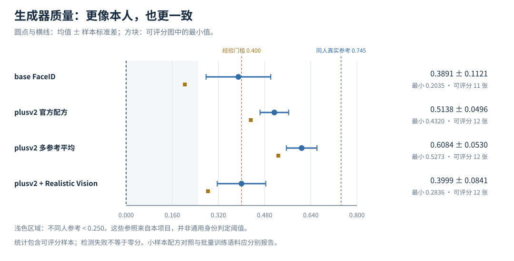
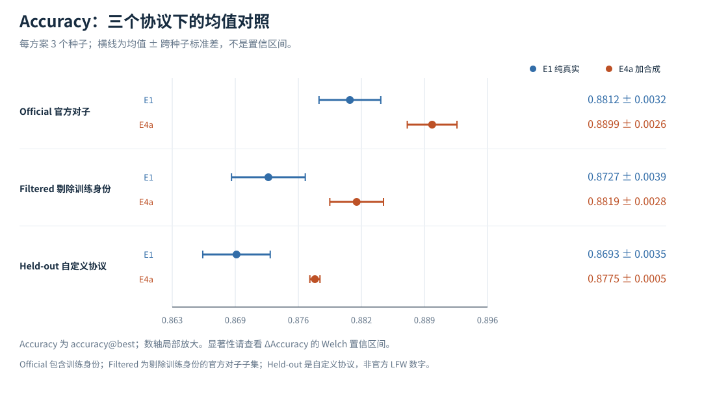
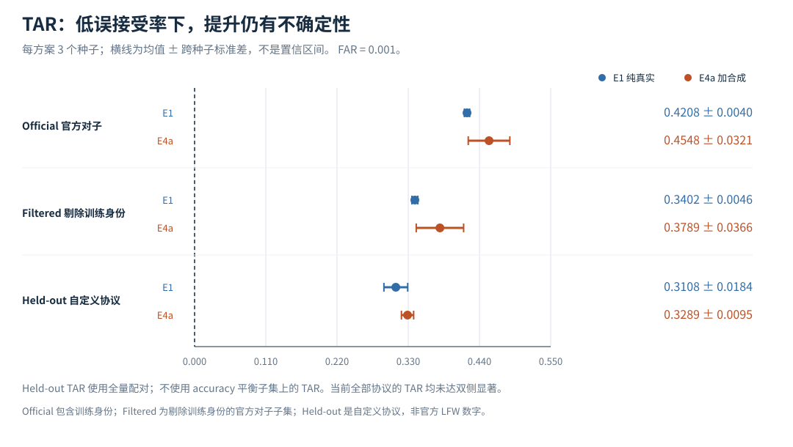
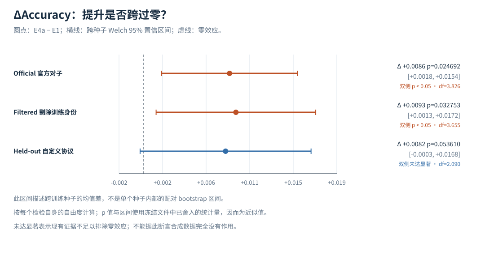
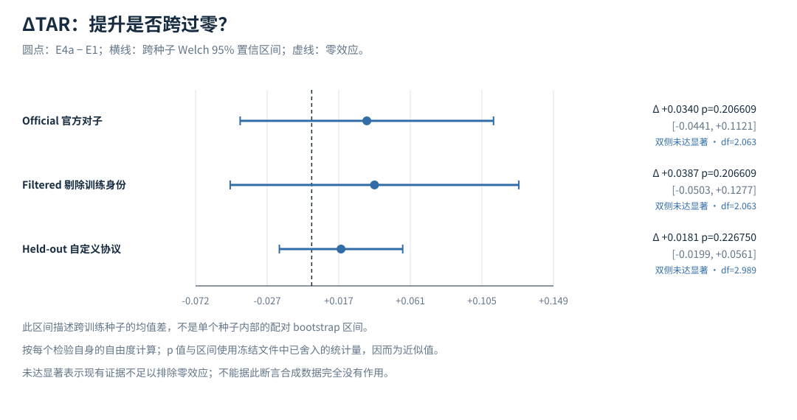

# AIGC 合成人脸数据用于人脸识别数据扩充：实验报告

> 结果表由 `tools/build_report.py` 从核对过的 `site/data/site_data.json` 自动生成。
> 导出数据追溯到冻结的 `results/runs/` 和独立的 CPU 复现目录；原实验 JSON 保持原样。
> 均值、标准差、t、df 沿用冻结字段；双侧 p 与 Welch 95% 区间由各自 df 推导，属于舍入记录下的近似值。

## 摘要

本项目检验：为已有身份合成更多照片，能否改善小规模人脸识别模型？
E1 使用 96 个身份、3,590 张真实训练图；E4a 加入 755 张筛选后的合成图，占合并训练集 17.4%。
两方案各运行 3 个训练种子，并分别报告 official、filtered 与自定义 held-out 协议。
三个协议下 Accuracy@best 的跨种子均值均上升，其中 official 和 filtered 达到名义双侧 0.05 水平；
held-out accuracy 的 p≈0.053610，未达到该标准。
各协议 TAR@FAR=0.001 的均值差为正，但均未达双侧显著，当前不能确认低误接受率下的稳定增益。
独立 CPU E0 复现与冻结基线的汇总指标在记录的六位小数下一致，且保存的测试日志记录 156 项通过。

## 1. 研究问题与相关工作

研究对象是已有身份的数据扩充，而非证明合成照片可以替代全部真实数据。
Q1 比较 E1 与 E4a；Q2 比较身份保持生成配方，随后观察其下游效果。
LFW 是面向非受控环境人脸验证的数据集 [1]；其评测协议强调训练数据和报告方式的可比性 [2]。
识别损失采用 ArcFace [3]；生成路线结合潜扩散模型 [4]、DDIM 采样 [5] 和 IP-Adapter [6]。
FaceID-plusv2 的具体接口与研究用途限制以作者模型卡为依据 [11]，不把普通 IP-Adapter 论文当作全部 FaceID 实现细节的出处。

SynFace 研究合成与真实数据间的域差距和类内变化 [7]；DigiFace-1M 使用数字人脸渲染并考察增强 [8]；
DCFace 通过身份与风格双条件控制变化 [9]。这些工作支持同时关注身份一致性和多样性，
但其数据规模、训练设置与协议不同，本报告不把外部成绩与当前 Accuracy@best 直接排名。

## 2. 方法与评测口径

### 2.1 数据与流水线

真实图经检测、对齐后形成 E1 训练集；同身份参考图用于身份保持生成，筛选后与真实图合并形成 E4a；
两方案使用同一识别骨干，随后按多个协议评测。

| 数据项 | 记录及来源 |
| --- | --- |
| LFW 全量 | 5,749 个身份、13,233 张图；原始数据集文献 [1] |
| E1 训练集 | 96 个身份、3,590 张真实图；E1 metrics 的 train_set |
| E4a 训练集 | 3,590 张真实图 + 755 张合成图，共 4,345 张；E4a train_set |
| 合成比例 | 755/4345 = 17.4%；分母是合并训练集 |
| 选择与过滤 | 评测记录中的训练身份过滤规则为 min_images=15；实际身份名单应以训练 manifest 为准 |

原图按人物目录保存；`data/raw/lfw/lfw` 为本机解压后的照片目录，归档和配对清单位于上一级。
类别失衡是当前小样本设置的局限。初稿中的最大类、最小类与比例缺少同一训练集口径的原始统计佐证，
本次不继续使用这些精确数值；不能把 E4a 合并集的比例当作 E1 真实训练集比例。

### 2.2 生成配方与筛选

最终采用配方来自 `w3-generator-comparison/comparison.json` 的 final_recipe：

| 设置 | 冻结记录 |
| --- | --- |
| ID 适配器 | IP-Adapter-FaceID-plusv2 (ip-adapter-faceid-plusv2_sd15.bin) |
| 底模 / VAE | sd15 (original) / sd-vae-ft-mse |
| ID 模型 / 参考 | buffalo_l (normed_embedding) / mean (multi-reference) |
| shortcut / s_scale | True / 1.0 |
| CLIP 层 / 输入 | -2 / face_align.norm_crop(image, kps, image_size=224) |
| CLIP 负例 | encoder output for a zero image (official), not a zero tensor |
| 调度器 / 步数 | DDIM (official params) / 30 |
| guidance / IP scale | 7.5 / 1.0 |

结构参考轮换、质量地板与冗余剪枝等实现记录见 [W3-GENERATION.md](W3-GENERATION.md)。
本报告可由训练元数据核实加入的合成图数量；初稿给出的整批生成耗时、剪枝相似度以及筛选后图集的精确 id_sim 均值，
不在当前导出的冻结统计字段中，故不再作为本报告的量化证据。配方对照与筛选后训练图集是不同总体。

### 2.3 训练与实验重复

识别模型为 iresnet18，参数量 62,556,544，损失记录为 arcface (self-trained)。
E1 与 E4a 各有 3 个种子；优化细节由对应实验配置和训练日志确定，
各运行 metrics 中的 epochs 记录不是自动等价于配置的总训练轮数。

| E1 seed0 记录项 | 值 |
| --- | --- |
| optimizer | sgd |
| lr | 0.1 |
| momentum | 0.9 |
| weight_decay | 0.0005 |
| scheduler | cosine |
| batch_size | 64 |
| grad_accum | 1 |
| amp | True |

E4b 高质量子集记录 448 张合成图，合并后占 11.1%；当前只有 seed0，official accuracy=0.887515、TAR=0.459686。该单次结果不足以断言它优于或劣于 E4a。

### 2.4 三种协议与实际使用规模

下表取 E1 seed0 作为规模示例。计划配对数与检测后实际有效配对数分别报告：

| 协议 | 清单配对数 | accuracy 有效对 | TAR 有效对 | accuracy 缺失对 |
| --- | --- | --- | --- | --- |
| official 官方配对 | 6,000 | 5,983 | 5,983 | 17 |
| filtered 过滤子集 | 5,553 | 5,539 | 5,539 | 14 |
| held-out 自定义协议 | 125,191 | 22,667 | 124,635 | 96 |

Official 使用官方配对清单，记录中包含项目训练身份；虽然清单带有 10 折标记，
此处汇总 Accuracy@best 在测试分数上选择最佳阈值，不能视为文献中的独立留出折验证成绩 [2]。
Filtered 删除涉及训练身份的官方对子，但仍来自同一数据源。
Held-out 是自定义、与本项目训练身份不相交的补充协议，不是官方 LFW 成绩；
它用平衡子集报告 accuracy，用全量有效配对报告 TAR，不能取平衡子集 TAR 替代全量 TAR。

TAR 阈值由当前评测负对分布确定，报告实际 FAR。阈值校准与测试未完全独立，
因此这些指标用于当前实验比较，不能直接代表部署性能。
身份交集为零指本项目训练 manifest 与评测身份，不意味着已排除外部预训练模型的数据重叠。

## 3. 实验结果

### 3.1 小样本生成配方对照

协议：4 个身份 × 3 个 seed，三组使用相同身份与相同种子（配对比较）。ID 相似度评分器：filter_synth.py (buffalo_l, det 320)。

| 方案 | 可评分/生成数 | id_sim 均值 | 最小值 |
| --- | --- | --- | --- |
| IP-Adapter-FaceID (base, ID 一路) | 11/12 | 0.3891 | 0.2035 |
| IP-Adapter-FaceID-plusv2 (ID + CLIP 两路, shortcut=True) | 12/12 | 0.5138 | 0.4320 |
| plusv2 + 多参考平均嵌入（最终采用） | 12 张可评分 | 0.6084 | 0.5273 |
| plusv2 + Realistic Vision V6 底模 | 12/12 | 0.3999 | 0.2836 |

多参考方案在这次小样本对照中取得更高均值和最低值，支持把它作为后续生成配方。
base 的一个生成样本未被评分，比较还可能受检测筛选影响。
该均值 0.6084 对应 12 张配方对照样本，
不能当作 755 张筛选后训练图的均值。Realistic Vision 组合在本次设置中得分更低，
这不足以证明所有参数与底模版本都不兼容。项目参照点也不是普适身份判定阈值。



### 3.2 E1 与 E4a：均值、种子波动与检验

每格为 3 个种子的均值 ± 样本标准差（ddof=1）。以下检验沿用冻结汇总的双侧 Welch 方法 [12]：

| 协议 | 指标 | E1 | E4a | Δ E4a−E1 | t | df | 近似 p | 判定 |
| --- | --- | --- | --- | --- | --- | --- | --- | --- |
| official 官方配对 | Accuracy@best | 0.8812 ± 0.0032 | 0.8899 ± 0.0026 | +0.0086 | 3.5927 | 3.826 | 0.024692 | 达到名义双侧 0.05 |
| official 官方配对 | TAR@FAR=0.001 | 0.4208 ± 0.0040 | 0.4548 ± 0.0321 | +0.0340 | 1.8193 | 2.063 | 0.206609 | 未达双侧 0.05 |
| filtered 过滤子集 | Accuracy@best | 0.8727 ± 0.0039 | 0.8819 ± 0.0028 | +0.0093 | 3.3503 | 3.655 | 0.032753 | 达到名义双侧 0.05 |
| filtered 过滤子集 | TAR@FAR=0.001 | 0.3402 ± 0.0046 | 0.3789 ± 0.0366 | +0.0387 | 1.8193 | 2.063 | 0.206609 | 未达双侧 0.05 |
| held-out 自定义协议 | Accuracy@best | 0.8693 ± 0.0035 | 0.8775 ± 0.0005 | +0.0082 | 3.9819 | 2.090 | 0.053610 | 未达双侧 0.05 |
| held-out 自定义协议 | TAR@FAR=0.001 | 0.3108 ± 0.0184 | 0.3289 ± 0.0095 | +0.0181 | 1.5175 | 2.989 | 0.226750 | 未达双侧 0.05 |

这是未作多重比较校正的名义检验；不同协议共享图片和身份，结果并不独立。
小样本对分布假设敏感；原始 Welch 检验也没有把相同数字种子自动视为有效配对设计。
因此“名义显著”需要连同数据重叠、阈值选择及重复数一起解释。





### 3.3 均值差的 95% 区间

区间 = 冻结 Δ ± t(0.975, 各检验 df) × 冻结 SE；与上方种子标准差不同。
冻结 t、df、SE 已舍入，下面 p 与区间都是近似推导值，不覆盖原实验文件。

| 协议 | 指标 | 均值差 | Welch 95% 区间 |
| --- | --- | --- | --- |
| official 官方配对 | Accuracy@best | +0.008635 | [+0.001839, +0.015431] |
| official 官方配对 | TAR@FAR=0.001 | +0.034014 | [-0.044120, +0.112148] |
| filtered 过滤子集 | Accuracy@best | +0.009268 | [+0.001294, +0.017242] |
| filtered 过滤子集 | TAR@FAR=0.001 | +0.038745 | [-0.050259, +0.127749] |
| held-out 自定义协议 | Accuracy@best | +0.008235 | [-0.000306, +0.016776] |
| held-out 自定义协议 | TAR@FAR=0.001 | +0.018098 | [-0.019935, +0.056131] |





Held-out accuracy 的区间跨零；不能因为 t 较大，就沿用固定临界值宣布显著。
Welch 的临界值由每个检验的 df 决定，不存在统一的“每组 n=3 临界值”。
三个协议下 TAR 区间均跨零；均值向好与确认稳定改善是不同强度的结论。

### 3.4 Held-out TAR 的逐种子差异

| 种子 | E1 TAR | E4a TAR | 差值 |
| --- | --- | --- | --- |
| 0 | 0.330777 | 0.318879 | -0.011898 |
| 1 | 0.306980 | 0.337652 | +0.030672 |
| 2 | 0.294641 | 0.330160 | +0.035519 |

配对点差的样本标准差为 0.026090，均值为 +0.018098。
存在一个负差和两个正差，说明需要检查种子敏感性；不能据此断言真实增益已得到证明。
冻结汇总另记录 seed0 的配对 bootstrap：2,000 次重采样，Δ 的 5%–95% 分位区间 [-0.027700, +0.002481]，正差重采样比例 8.6%。这是固定一次训练结果下的重采样分布，既不是跨种子 95% Welch 区间，也不是‘真实增益为正’的后验概率。seed1/seed2 的旧稿区间未在本次冻结汇总中逐项核实，因此不继续引用。

冻结的预训练 buffalo_l 参考：held-out Accuracy@best=0.999294，TAR=0.998942。该模型具有不同的外部预训练数据与训练预算，不能据此把差距唯一归因于当前训练身份数量。

## 4. 方法学讨论

### 4.1 协议改变会改变效应估计

Official TAR 均值差 +0.034014，held-out 为 +0.018098。
前者更大，且 official 已知包含训练身份；但两协议还改变了配对数量与构成，
不能把全部差异因果归于身份泄漏，也不能把两个均值差的比值当作无偏的泄漏量估计。
两个 TAR 检验都未达显著。

### 4.2 FAR 的经验分辨率

Held-out 清单计划包含 11,381 个正对与 113,810 个负对；检测后有效数另见前表。
经验 FAR 的步长为 1/N_negative；负对数较少时，低 FAR 阈值受少数尾部样本影响。
增加有效负对能改善分辨率，但不会消除训练随机性、身份相关性、阈值校准偏差或域偏移。
当前证据支持优先增加训练重复并开展独立数据验证，不支持“继续增加评测数据完全无意义”。

### 4.3 指标与质量代理不能互相替代

Accuracy@best 与低 FAR 下 TAR 反映不同工作点，前者提高不能推出后者稳定提高。
ID 相似度反映特定嵌入空间中的身份一致性，不等于照片真实度、多样性、公平性或隐私安全。
条件生成与筛选共用的模型会引入度量依赖，需独立识别骨干和外部数据补充验证。

### 4.4 工程经验的证据范围

参数顺序、并列分数、空输入、缺少类别和 FAR 分辨率等问题已经加入评测器测试。
质量与冗余的权衡，以及训练稳定性排查记录，可以指导复核；
但本报告不把缺少对应完整消融日志的历史失败次数，或一次改动前后的训练 accuracy，写成已证实的因果效应。

## 5. 局限与后续验证

1. **身份重叠与同源评测。** Official 有项目训练身份重叠；filtered/held-out 缓解该问题，却仍来自 LFW。
   身份划分可以避免项目内重叠，“泄漏不可避免”不是正确表述；外部预训练重叠尚未完整审计。
2. **测试集阈值选择。** Accuracy@best 和 TAR 的阈值均使用当前评测分数，缺少完全独立的校准集。
   下一步应固定独立校准阈值，再在留出集上报告指标 [2]。
3. **训练重复不足。** 各主方案只有 3 个种子，TAR 尚不显著，held-out accuracy 亦未达到双侧 0.05。
   不显著不等于无效，也不能声称已确认真实增益；目前没有充分功效分析证明某个固定种子数必然够用。
4. **统计假设与多重比较。** 小样本 Welch 和多个共享数据的检验具有局限。
   需预先确定主要终点，并在更多重复下检查适当的配对或稳健分析，而非事后选择显著方法。
5. **相关配对与重采样。** 同一身份可参与多个验证对；按对 bootstrap 不等于按身份或人物簇重采样。
   固定种子的重采样区间也不包含重新训练的不确定性。
6. **比例与筛选消融不足。** 主方案合成占比为 17.4%；E4b 仅有一次运行，缺少完整比例扫描。
   样本数量与质量门槛同时变化，不能独立证明“越多越好”或“越相似越好”。
7. **规模与架构有限。** 当前仅 96 个训练身份、一个自训练识别骨干。
   与大规模预训练模型的差距还有数据分布、模型训练和预算等因素，不能唯一归因于样本量。
8. **生成质量度量依赖。** 配方对照样本少；生成条件和筛选所用身份模型存在关联，
   应加入独立度量，并报告失败样本及不同人物的表现 [7–9]。
9. **公平性与跨域未评估。** 本项目没有完整的人口统计分组、跨数据集、姿态和年龄鲁棒性测试，
   整体指标不能替代对各群体的影响分析。
10. **隐私与使用许可。** 生成已有真实身份的照片并不自动消除隐私风险；相关研究发现合成人脸可能泄露生成器训练身份 [10]。
    FaceID 作者模型卡明确研究用途限制 [11]；本报告不把代码许可当作模型、照片或衍生数据的授权。

## 6. CPU 复现与展示重建

### 6.1 已完成的 CPU E0 验证

评测时间：2026-10-07T16:41:31+08:00；Python：3.11.16；
识别执行器：CPUExecutionProvider；检测尺寸：640；选脸策略：center。
特征提取成功 7,690 张、失败 11 张，
记录耗时 6906.79 秒。

| 协议 | 指标 | 冻结基线 | CPU 复现 |
| --- | --- | --- | --- |
| official | Accuracy@best | 0.998496 | 0.998496 |
| official | TAR@FAR=0.001 | 0.996989 | 0.996989 |
| official | 实际 FAR | 0.000668 | 0.000668 |
| filtered | Accuracy@best | 0.998375 | 0.998375 |
| filtered | TAR@FAR=0.001 | 0.996570 | 0.996570 |
| filtered | 实际 FAR | 0.000686 | 0.000686 |

验收范围是现有六位小数精度的汇总指标一致性，不宣称阈值、检测框或逐对分数逐位一致。
测试日志记录 **156 passed**；这是保存日志的结果，不代表本脚本重新执行了测试。
证据：[CPU 复现报告](../reports/e0_cpu_reproduction.b.md)、[测试日志](../reports/e0_cpu_reproduction.b.pytest.txt)、
[指标 JSON](../results/reproductions/e0-buffalo_l-lfw-b-cpu/metrics.json)、[逐对分数 CSV](../results/reproductions/e0-buffalo_l-lfw-b-cpu/pairs.csv)。

如需重新执行 CPU 推理，先准备项目环境、私有 local 配置、LFW 和模型缓存，再运行：

```powershell
python scripts/evaluate.py --exp-id e0-buffalo_l-lfw --cpu --no-cache --out "results/reproductions/e0-buffalo_l-lfw-b-cpu"
```

已有验证证据无需重跑。`--no-cache` 重新提取特征，输出放在独立复现目录，保留冻结实验结果。
下载配置没有提供可信预期校验和；本机下载摘要用于文件一致性核对，不能单独证明来源真实性。

### 6.2 重建展示与报告

```powershell
python tools/export_site_data.py
python tools/build_site_charts.py
python tools/build_report.py
python tools/build_site_page.py
```

这些脚本读取已有结果，不生成模型样本、不重新训练、不运行 CPU 特征提取。
随后双击 `site/index.html`；复现证据副本随站点提供。
GPU 生成与训练的历史配方见 [W3-GENERATION.md](W3-GENERATION.md) 及对应 configs/exp 配置，
本轮报告整理不重新执行这些实验。

## 7. 交付状态

| 交付物 | 位置 | 当前状态 |
| --- | --- | --- |
| 冻结生成与识别结果 | results/runs/ | 保留原记录 |
| 离线网站、图表与视觉对照 | site/index.html、site/assets/ | 已构建，CPU 栏目由脚本更新 |
| 评测器修复与边界测试 | src/aigcfr/eval/verify.py、tests/ | 已有合并记录 |
| CPU E0 复现证据 | results/reproductions/、reports/e0_cpu_reproduction.b.* | 已完成 |
| 报告数字与统计核对 | 本文、reports/report_numeric_audit.b.md | 本次生成 |
| 外部读者三分钟验收 | #25 验收项 | 暂未记录完成 |
| 排版导出 PDF / DOCX | reports/AIGCFR_report.b.pdf 与 .docx | 已导出，实验数字沿用本文 |
| issue 索引同步 | docs/issues/00-INDEX.md；reports/issue_index_snapshot.b.json | 已通过 GET 读取实际 Issue；状态为快照，排除 PR |

## 8. 参考文献

以下为实际引用的原始论文、报告和官方资料。外部文献支持方法或风险讨论，不提供本项目实验数字。
作者、题名与来源已核对；实现文档访问日期为 2026-10-07。

[1] Huang, G. B.; Mattar, M.; Berg, T.; Learned-Miller, E. Labeled Faces in the Wild: A Database for Studying Face Recognition in Unconstrained Environments. ECCV Workshop, 2008. [原始来源](https://people.cs.umass.edu/~elm/papers/Huang_eccv2008-lfw.pdf)

[2] Huang, G. B.; Learned-Miller, E. Labeled Faces in the Wild: Updates and New Reporting Procedures. UMass Technical Report UM-CS-2014-003, 2014. [原始来源](https://people.cs.umass.edu/~elm/papers/lfw_update.pdf)

[3] Deng, J.; Guo, J.; Xue, N.; Zafeiriou, S. ArcFace: Additive Angular Margin Loss for Deep Face Recognition. CVPR, 2019; arXiv:1801.07698v3. [原始来源](https://arxiv.org/abs/1801.07698v3)

[4] Rombach, R.; Blattmann, A.; Lorenz, D.; Esser, P.; Ommer, B. High-Resolution Image Synthesis with Latent Diffusion Models. CVPR, 2022. [原始来源](https://arxiv.org/abs/2112.10752)

[5] Song, J.; Meng, C.; Ermon, S. Denoising Diffusion Implicit Models. ICLR, 2021. [原始来源](https://arxiv.org/abs/2010.02502)

[6] Ye, H.; Zhang, J.; Liu, S.; Han, X.; Yang, W. IP-Adapter: Text Compatible Image Prompt Adapter for Text-to-Image Diffusion Models. arXiv:2308.06721, 2023. [原始来源](https://arxiv.org/abs/2308.06721)

[7] Qiu, H.; Yu, B.; Gong, D.; Li, Z.; Liu, W.; Tao, D. SynFace: Face Recognition with Synthetic Data. ICCV, 2021. [原始来源](https://arxiv.org/abs/2108.07960)

[8] Bae, G.; de La Gorce, M.; Baltrusaitis, T.; Hewitt, C.; Chen, D.; Valentin, J.; Cipolla, R.; Shen, J. DigiFace-1M: 1 Million Digital Face Images for Face Recognition. WACV, 2023. [原始来源](https://arxiv.org/abs/2210.02579)

[9] Kim, M.; Liu, F.; Jain, A.; Liu, X. DCFace: Synthetic Face Generation with Dual Condition Diffusion Model. CVPR, 2023. [原始来源](https://arxiv.org/abs/2304.07060)

[10] Otroshi Shahreza, H.; Marcel, S. Unveiling Synthetic Faces: How Synthetic Datasets Can Expose Real Identities. NeurIPS Workshop on New Frontiers in Adversarial Machine Learning, 2024. [原始来源](https://arxiv.org/abs/2410.24015)

[11] h94 / IP-Adapter authors. IP-Adapter-FaceID official model card. Implementation and research-use conditions; accessed 2026-10-07. [原始来源](https://huggingface.co/h94/IP-Adapter-FaceID)

[12] SciPy developers. scipy.stats.ttest_ind documentation. Welch test and two-sided alternatives; accessed 2026-10-07. [原始来源](https://docs.scipy.org/doc/scipy/reference/generated/scipy.stats.ttest_ind.html)

## 附录：数字与来源

训练数量与运行规模来自各 metrics 的 train_set、model、protocol_detail 与 benchmarks。
Held-out TAR 专门读取 `benchmarks.lfw_heldout.tar_at_far_full['1e-03'].tar`。
跨种子统计取 w4 comparison 的 arms[*].protocols 和 tests；配方表取 w3 comparison 的 final_recipe。
CPU 表取独立复现 metrics，与 E0 冻结记录对照；passed 数来自保存的 pytest 文本日志。
LFW 全量规模来自文献 [1]。本次没有把旧稿未核实的筛选均值或类别比例伪装成 JSON 结果。

导出来源及摘要：

- `results/runs/w3-generator-comparison/comparison.json`；SHA-256：`5fc8dab10bb68a0c73d550ea6ea27bb5d5843578d66987492ee05f0735eb5695`。
- `results/runs/w4-e4-comparison/comparison.json`；SHA-256：`566a4c634cf1d9a2719490eeade0039f3ff735e7489bfb11b8222608536c7838`。
- `results/runs/e0-buffalo_l-heldout/metrics.json`；SHA-256：`a7fb2bef44c37f1ecee740e1ddeb5d1b02434a0717058477f497cd7b9d08e12b`。
- `results/runs/e0-buffalo_l-lfw/metrics.json`；SHA-256：`7d1fc48c9eff6ba9e76366c000a72edef3a273a9a4a451cf3219a3abab27f60b`。
- `results/runs/e1-real-only-seed0/metrics.json`；SHA-256：`e182fac66f46822ad224654c6b6da77effd78a554fbd9298b758b738a7984a13`。
- `results/runs/e1-real-only-seed1/metrics.json`；SHA-256：`7a6347e43184ed087d793a563592ffc825502985d503a348368e3bbf2e55945b`。
- `results/runs/e1-real-only-seed2/metrics.json`；SHA-256：`41db6118201848acc22f11efb0d50e953970547cefc9a51cb73f7dca4adfca41`。
- `results/runs/e4-highquality-synth-seed0/metrics.json`；SHA-256：`f652eef443bb414b1151af3eee52f1c35b7dd74c8e3745f812fb014ea4120fbd`。
- `results/runs/e4-real-plus-synth-seed0/metrics.json`；SHA-256：`d22740ee0337a6f9c3d5fb49d48858249419fdfcfe53c43519fd95f2c0434bfe`。
- `results/runs/e4-real-plus-synth-seed1/metrics.json`；SHA-256：`467e11fac7ada0f8a70712d00853ea49bfda072d1110fa2bf9c4b94493343e12`。
- `results/runs/e4-real-plus-synth-seed2/metrics.json`；SHA-256：`6599e6ecbb5965e0b0a10b5a37e5d92830f99700d3fdb61240e024230ce14da1`。
- `results/reproductions/e0-buffalo_l-lfw-b-cpu/metrics.json`；SHA-256：`b9a80d36e0dd4fe492d5245d35e995f9c62cff124866dd2d1a5135842460e120`。
- `reports/e0_cpu_reproduction.b.md`；SHA-256：`4285decb10969c5081663f8c98e1b01ac70d7ea25bd3273025f929041161bf8a`。
- `reports/e0_cpu_reproduction.b.pytest.txt`；SHA-256：`b2bdb284e628ebdfb065f29df2a9d64aa626887bb7929eb19397d7c07421eb4e`。
