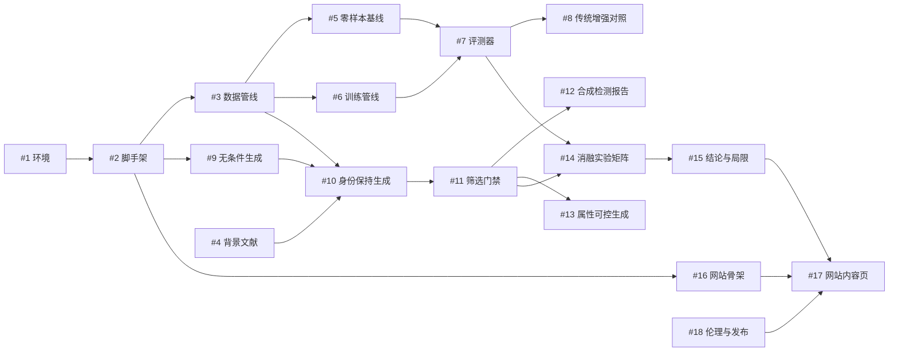

# 工作流（Workflow）

> 本文档回答：**按什么顺序做、每步怎么验收、卡住了怎么降级。**
> 架构与设计依据见 [`FRAMEWORK.md`](FRAMEWORK.md)；具体任务卡见 [`issues/`](issues/)。

---

## 0. 总览

### 0.1 一句话工作流

```
挑一个 Issue → 建分支 → 按验收标准做完 → 跑通复现命令 → 提交 PR（Closes #N）→ 合并 → 更新看板
```

### 0.2 六个 Sprint（总预算 4~6 周业余时间）

| Sprint | 名称 | 工期 | 对应 Milestone | 出口条件（必须全绿才进入下一阶段） |
|---|---|---|---|---|
| **S0** | 地基 | 2~3 天 | M0 脚手架与地基 | 环境报告生成、数据落盘、manifest 契约冻结、背景文档成型 |
| **S1** | 基线与评测 | 3~5 天 | M1 基线与评测 | 有 E0/E1 两组数字，且**能一条命令重跑** |
| **S2** | 生成与筛选 | 5~7 天 | M2 生成与筛选 | 生成→筛选→入库闭环跑通，图库里能看到「同人不同姿态」 |
| **S3** | 实验与结论 | 7~10 天 | M3 实验矩阵与结论 | E2~E5 矩阵跑完（≥1 seed），结论与局限写完 |
| **S4** | 网站 | 4~6 天 | M4 网站与发布 | 网站能本地打开，所有图表来自真实 `metrics.json` |
| **S5** | 收尾发布 | 2~3 天 | M4 网站与发布 | 伦理文档、README、Release v0.1、补 seed |

> ⏱️ **时间失控的唯一原因**通常是：在某一层追求完美。每个 Sprint 结尾必须停下来做一次「是否降级」的判断（见 §5）。

### 0.3 任务依赖图



**并行机会**（一个人做，但可以交替做，避免长时间卡在同一件事上）：
- #4（读论文）可以和 #1~#3（跑环境/下数据）交替，下载时正好读文献。
- #16（网站骨架）可以提前做，因为它只依赖**契约**，不依赖实验数据；先用假数据把界面搭出来，等 #14 出结果直接替换 JSON。
- #12（检测器报告）可以和 #14（跑矩阵）并行，因为矩阵训练很耗时，等待时做别的事。

---

## 1. 标准工作流（每个 Issue 都照这个走）

### 1.1 六步循环

| 步骤 | 动作 | 产出 |
|---|---|---|
| 1. 选卡 | 从看板挑一个「没有阻塞依赖」的 Issue，把它拖到 `In Progress` | — |
| 2. 建分支 | `git checkout -b feat/12-synth-detector` | 分支 |
| 3. 实现 | 按 Issue 的「任务清单」逐条打勾 | 代码/文档 |
| 4. 自验 | 按 Issue 的「验收标准」逐条验证，**跑一遍复现命令** | 证据（截图/输出/JSON） |
| 5. 提交 | `git commit -m "feat(filter): add synth detector report (#12)"`；PR 描述里写 `Closes #12` | PR |
| 6. 收尾 | 合并后：更新 `docs/`、把结果写进 `results/`，Issue 自动关闭 | 更新的文档 |

### 1.2 分支命名

```
feat/<issue号>-<短描述>     新功能      feat/10-identity-preserving-gen
exp/<issue号>-<短描述>      实验        exp/14-mix-ratio-matrix
docs/<issue号>-<短描述>     文档        docs/4-background-survey
fix/<短描述>                修 bug      fix/manifest-path-normalize
chore/<短描述>              杂务        chore/add-gitignore-data
```

### 1.3 Commit 规范（够用版）

```
<类型>(<范围>): <做了什么> (#<issue号>)
类型：feat | fix | docs | exp | chore | test | refactor
范围：data | generate | filter | train | eval | site | docs
示例：exp(train): add real+synth mix ratio 0.25 config (#14)
```

### 1.4 每个 Issue 完成的定义（DoD）

一个 Issue 只有在下面 5 条全部满足时才算完成：

- [ ] Issue 里的「任务清单」全部勾选，或明确写明哪几条被有意跳过及原因
- [ ] 「验收标准」逐条有证据（命令输出 / 文件路径 / 截图）
- [ ] **有可复现入口**：一条命令能从原始状态重跑（脚本或 `scripts/` 里的入口）
- [ ] 产物已落盘到约定路径（`results/`、`docs/`、`configs/`），而不是留在临时文件里
- [ ] 相关文档（README / FRAMEWORK / RESULTS）已同步更新

> 🚫 **反模式**：Jupyter Notebook 里跑出结果，但不落盘、不写脚本、不留配置。这样一周后你自己都复现不出来。

---

## 2. 命令约定（统一入口，别记一堆参数）

所有操作尽量走统一入口，便于写进文档和 CI：

```bash
# 环境自检
python scripts/check_env.py

# 数据：下载 / 对齐 / 建 manifest
python scripts/download_data.py  --config configs/data/lfw.yaml
python scripts/build_dataset.py  --config configs/data/toy_train.yaml

# 生成 / 筛选
python scripts/generate.py       --config configs/gen/ipadapter_faceid.yaml
python scripts/filter.py         --config configs/filter/default.yaml

# 训练 / 评测
python scripts/train.py          --config configs/exp/e4-ipadapter-r25-seed0.yaml
python scripts/evaluate.py       --run results/runs/e4-ipadapter-r25-seed0

# 汇总 / 导出给网站
python scripts/summarize.py      --runs results/runs --out results/summary.csv
python scripts/export_site_data.py --results results --out site/public/data
```

**约定**：每个脚本都必须支持 `--config` 和 `--dry-run`（先打印将要做什么，不实际执行）。这样跑批之前你能先确认。

---

## 3. 实验工作流（这是项目的核心节奏）

### 3.1 加一个实验的标准流程

1. **写配置**：复制 `configs/exp/_template.yaml`，填写数据、模型、训练、评测四段。`exp_id` 遵循 `{阶段}-{生成器}-{比例}-{seed}`。
2. **注册到矩阵**：在 `configs/exp/matrix.yaml` 里加一行（用于 #14 的批量执行）。
3. **小规模试跑**：`--dry-run` → 用 2 个身份 1 个 epoch 试跑，确认管线通。
4. **正式跑**：训练 → 评测 → `results/runs/<exp_id>/metrics.json` 落盘。
5. **登记**：`python scripts/summarize.py` 更新 `results/summary.csv`。
6. **一句话结论**：写进 `docs/RESULTS.md` 对应表格行（**只写事实，不写感受**）。

### 3.2 结果记录纪律

| 规则 | 原因 |
|---|---|
| 每个实验至少 3 个 seed，报均值±标准差 | 单次结果在小数据集上噪声极大 |
| 失败的实验也要保留记录（`status: failed` + 原因） | 「试过但没用」本身是结论，也避免重复踩坑 |
| 不删掉「难看」的结果 | 选择性报告 = 学术不端 |
| 每次跑完记录 GPU 型号与耗时 | 用于 RQ5（最低可行配方） |

### 3.3 每周固定动作（周日 30 分钟）

- [ ] 更新 `results/summary.csv`，把本周新增的 run 汇总
- [ ] 更新 `docs/RESULTS.md` 的表格与「本周发现」
- [ ] 看板回顾：这周哪个 Issue 卡住了？卡在**技术**还是**范围**？写下周的唯一优先事项
- [ ] 检查 `data/` 没被误提交（`git status` 里不该出现数据文件）

---

## 4. 看板与标签使用

| 标签 | 含义 | 怎么用 |
|---|---|---|
| `优先级:P0` | 不做完项目就断了 | 永远优先做 P0 |
| `优先级:P1` | 影响结论完整性 | 主干做完再做 |
| `优先级:P2` | 加分项 | 时间富余才做，可放弃 |
| `难度:入门` / `难度:中等` / `难度:进阶` | 预估难度 | 状态差/时间碎的时候挑「入门」 |
| `类型:*` | 环境/数据/生成/评测/实验/网站/文档 | 用于按类型筛选批量处理 |
| `good first issue` | 新手起手卡 | **第一个动的 Issue 从这里挑** |

**里程碑 = Sprint**。每个 Milestone 下的 Issue 全部关闭才算该阶段结束。

> 建议视图：Board 按 `Status` 分组（Todo / In Progress / Blocked / Done），再加一个筛选器 `label:优先级:P0`。

---

## 5. 决策卡点（Go / No-Go）与降级策略

每个 Sprint 结束时，用 5 分钟做一次判断。**降级不是失败，烂尾才是。**

### S0 出口判断
- 环境自检报告里有 GPU 名称和 CUDA 可用？→ 否则**先解决再往下走**（这是唯一不能绕过的卡点）
- 数据集下载成功且 manifest 能校验通过？→ 否则降级为「只用 LFW 一个数据集」

### S1 出口判断
- E0（预训练零样本）数字是否接近公开报道（LFW 通常 99%+）？
  - 是 → 评测管线可信，继续。
  - 否 → **停下修评测管线**，不要继续做生成。管线错了后面全白做。
- E1（real-only 自训练）数字是否明显低于 E0？→ 正常（数据少），记录下来即可。

### S2 出口判断
- 生成图**人工看**是否「像同一个人」？
  - 像 → 继续放量生成。
  - 不像/糊 → 调 prompt、换参考图、降分辨率要求；仍不行 → 触发**降级方案 A**：改用公开合成数据集 + 无条件生成，把 E4 标记为「未能验证」。
- 筛选通过率是否 ≥ 30%？→ 过低说明生成质量差，先修生成而不是放低阈值。

### S3 出口判断
- E2/E3/E4 相对 E1 的差异是否**大于 seed 噪声**？
  - 是 → 得到有效结论，进入写作。
  - 否 → 结论写成「在本规模下未观察到显著增益」+ 分析原因（这是**合格的负结果**，不要硬凑）。
- 时间是否已超预算 30%？→ 立刻执行**降级方案 B**：只保留 E1/E4 两组 × 1 seed，砍掉 E3/E5/E6。

### S4 出口判断
- 网站是否**不依赖本地服务**就能打开（纯静态）？
- 所有数字是否都能追到 `metrics.json`？（不许手写数字到网页里）

### 三档交付（提前决定，事到临头不纠结）

| 层级 | 包含 | 适用 |
|---|---|---|
| **最小可交付** | E0/E1/E4 + 单 seed + 6 个基础页面 | 时间只剩一半 |
| **标准交付** | 上面 + E2/E3 + 3 seed + 公平性/失败案例页 + 伦理文档 | 默认目标 |
| **加分交付** | 上面 + E5 比例曲线 + E6 属性可控 + 合成检测报告 + CI + 在线 Pages | 时间富余 |

---

## 6. 常见坑清单（Windows + 8 GB 显存 + 新手）

| 坑 | 症状 | 处理 |
|---|---|---|
| Python 版本太新 | `pip install torch` 找不到 wheel / 编译失败 | 用 conda 建 **3.11** 环境，**不要**用系统默认 3.14 |
| 显卡架构太新 | `CUDA error: no kernel image is available` | 装 **cu128**（或更新）的 torch 构建；先用 `torch.cuda.get_arch_list()` 确认含 sm_120 |
| 显存不够 | `CUDA out of memory` | 512×512、fp16、batch=1、`enable_model_cpu_offload()`；**生成与训练错峰** |
| Windows 路径 | 中文/空格路径导致库报错 | 项目路径保持英文；Python 里统一用 `pathlib` |
| 数据集路径写死 | 换机器跑不了 | 全部走 YAML 配置，不写绝对路径 |
| 对齐方式不一致 | 评测数字莫名偏低 | 训练与评测必须用**同一套** 5 点对齐模板（112×112） |
| 数据泄漏 | 数字异常高（比论文还高） | 检查训练身份与评测身份是否重叠；toy 测试集必须身份隔离 |
| 只测一次就下结论 | 结论翻车 | 每个配置 ≥ 3 seed，看均值±方差 |
| 把数据提交进 Git | 仓库巨大 / 隐私问题 | `.gitignore` 写死 `data/`、`*.pth`、`*.onnx`、`outputs/` |
| 长时间盯着一个坑 | 一天就没了 | **卡 2 小时规则**：卡满 2 小时 → 记录到 Issue 评论 → 换任务或走降级方案 |

### 卡住时的处理顺序

```
报错 → 完整读一遍错误信息 → 搜错误原文（带库名版本） → 看官方 issue 区
  → 2 小时还没解决 → 在该 Issue 下写评论（贴报错+已试过什么）→ 换一个不阻塞的任务
  → 连续 2 天卡同一处 → 执行该 Issue 的降级方案，把它拆小或换实现
```

---

## 7. 每周节奏建议（业余时间版）

| 时段 | 内容 | 时长 |
|---|---|---|
| 周中碎片时间 | 「入门」难度任务：写文档、下数据、整理结果表 | 30~60 min/次 |
| 周中整块时间 | 「进阶」任务：调生成、跑训练 | 2~3 h |
| 周末 | 跑批实验（训练很慢，让它自己跑）+ 周回顾 30 min | 半天 |

**关键**：把「等待型任务」（下载、生成、训练）安排在离开电脑前启动，回来收结果。时间利用率会翻倍。

---

## 8. 下一步（现在就做这三件事）

1. 打开 [`issues/`](issues/) 目录，从 **`good first issue`** 标签的卡片开始（推荐 #1 环境 → #3 数据 → #4 读文献 交替进行）。
2. 按 #2 把仓库骨架建起来（目录 + `.gitignore` + 配置文件模板）。
3. 在 GitHub 上把 Milestone M0 建成看板，把这 4 张卡拖进 Todo。

> 记住附录 A（MVP 闭环）的定义：**先用最小成本把整条线走通一次**，再回来加厚。你已经有了完整的任务拆解，接下来只需要每天推进一张卡。
